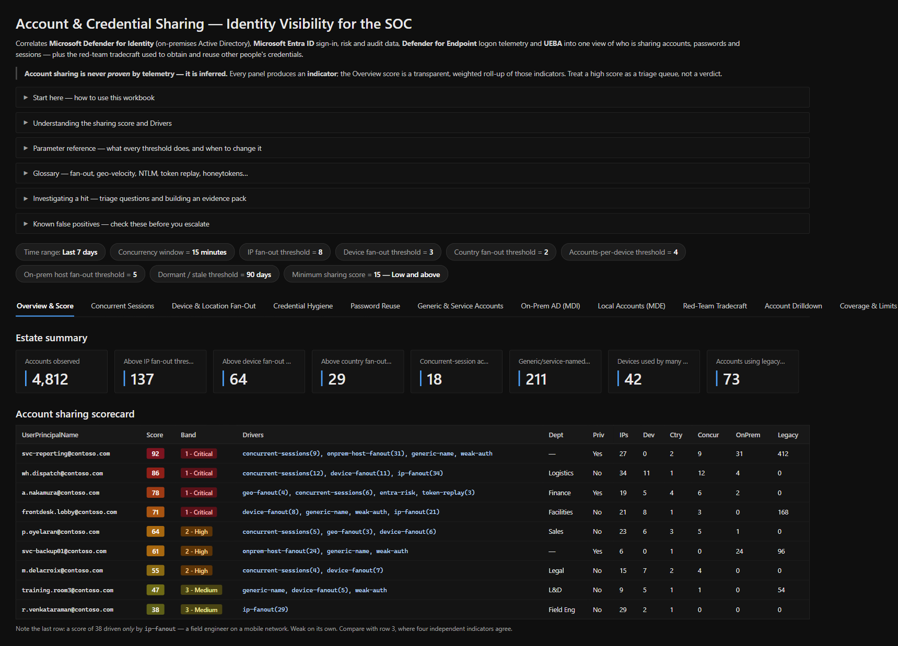
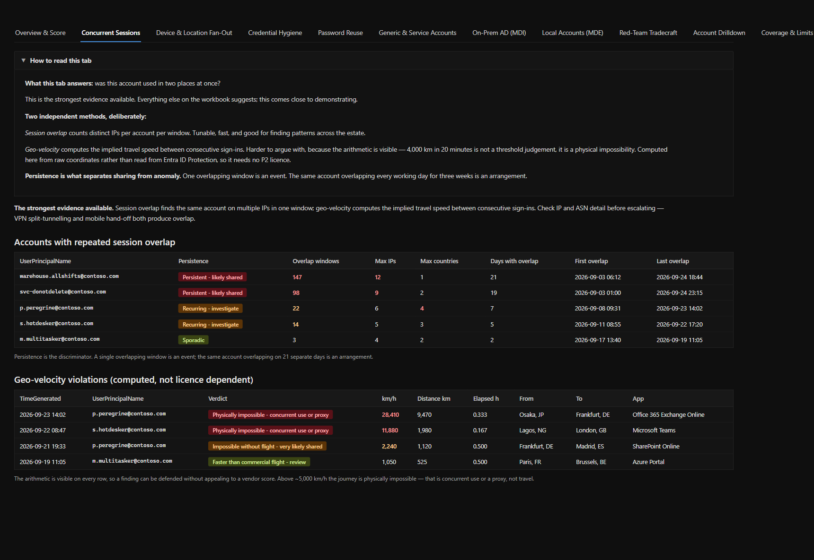
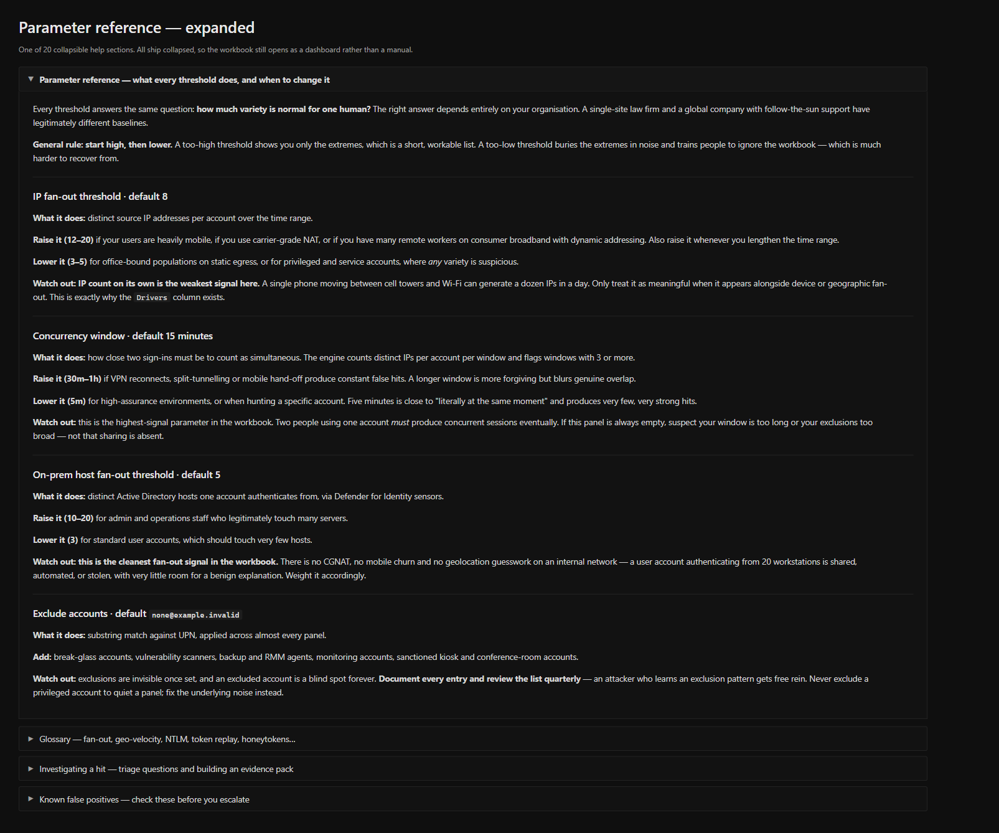
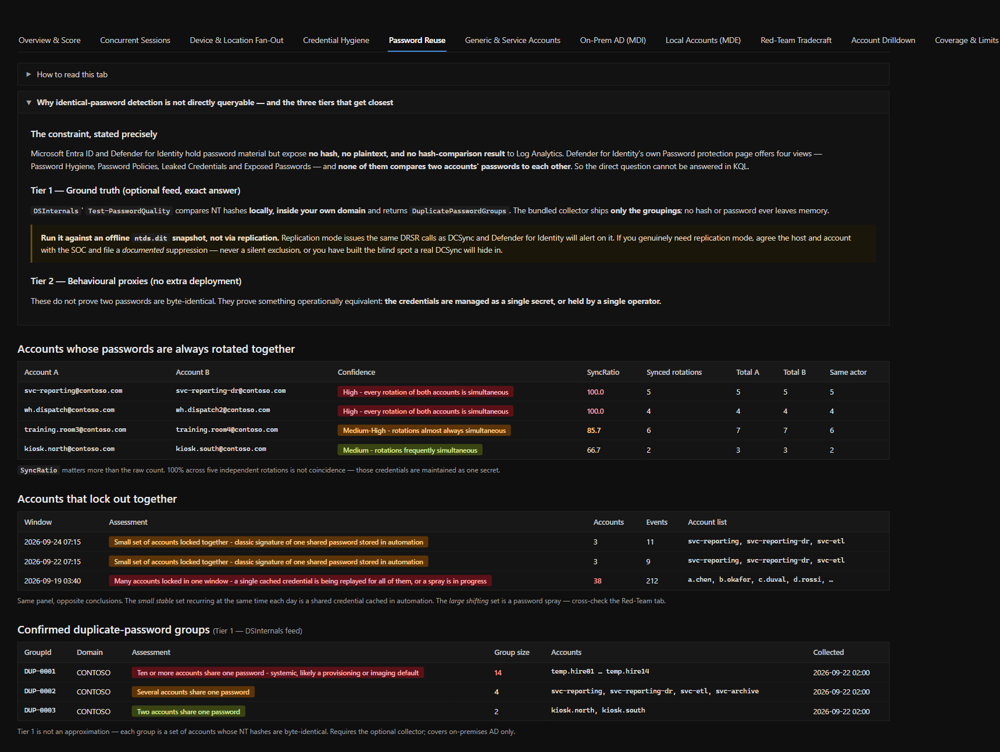
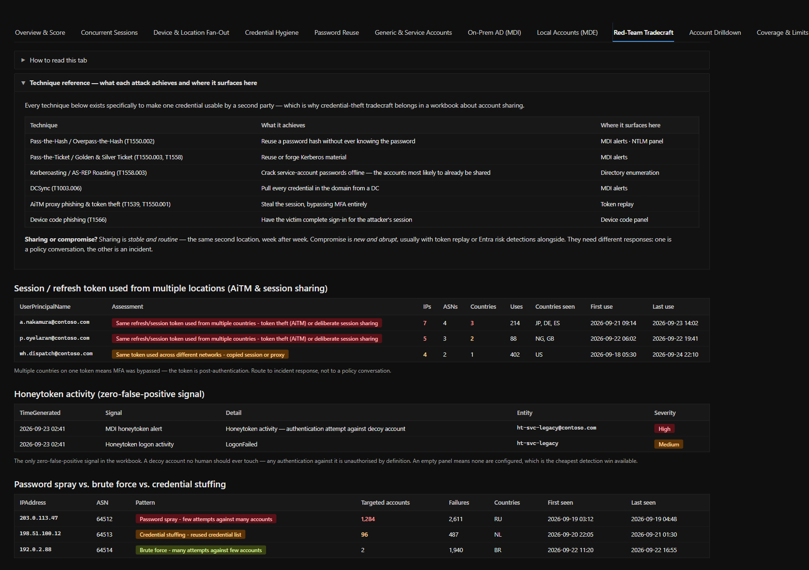
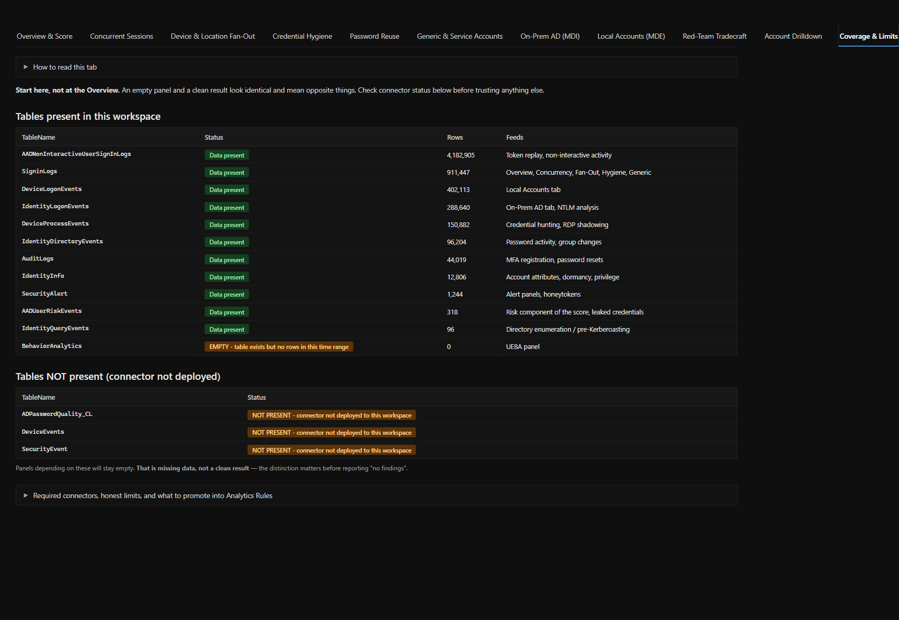

# Account &amp; Credential Sharing — Microsoft Sentinel Workbook

A Microsoft Sentinel workbook that correlates **Microsoft Defender for Identity**, **Microsoft Entra ID**, **Microsoft Defender for Endpoint** and **Sentinel UEBA** into a single view of account sharing, credential reuse, and the red-team tradecraft used to obtain and reuse other people's credentials.

**11 tabs · 54 query panels · 17 tunable parameters · 6 analytics rules · ~9,000 words of built-in guidance.**

---

## What problem this solves

Account sharing is one of the few security problems that is simultaneously common, high-impact, and almost never measured. It defeats attribution, breaks least privilege, invalidates audit trails, and produces exactly the same telemetry as a compromised credential.

Most identity-protection tooling reports it as a side effect of something else. This workbook makes it the subject.

> **Account sharing is never *proven* by telemetry — it is inferred.** Every panel produces an **indicator**. The score is a transparent, weighted roll-up of those indicators. Treat a high score as a triage queue, not a verdict.

---

## Screenshots

> ⚠️ **All screenshots use synthetic data.** No real tenant, account, IP address or location appears anywhere in this repository. The accounts, domains and addresses shown are fabricated for illustration and use [RFC 5737](https://datatracker.ietf.org/doc/html/rfc5737) / [RFC 2606](https://datatracker.ietf.org/doc/html/rfc2606) reserved ranges where addresses are shown.
>
> The account names are invented, but only barely. If `svc-donotdelete`, `warehouse.allshifts` and `svc-temp-2019` look familiar, that is the point — every one of them is a finding that names itself.

### Overview &amp; Score

The triage queue. The **Drivers** column matters more than the number — it names which indicators fired, which is what determines whether a score means anything.



`f.roadwarrior` scores 38 on `ip-fanout` alone — a field engineer on a mobile network, and almost certainly fine. `p.peregrine` scores 78 because four independent indicators agree. Same workbook, very different conversations.

### Concurrent Sessions

The strongest evidence available. Geo-velocity is computed from raw sign-in coordinates rather than read from Entra ID Protection, so it works without P2 licensing and the arithmetic is auditable.



Persistence is the discriminator: one overlapping window is an event, the same account overlapping on 21 separate days is an arrangement.

### Built-in guidance

~9,000 words across 20 collapsible sections, all shipped collapsed so the workbook still opens as a dashboard. Every threshold is documented with what it counts, when to raise it, when to lower it, and what to watch out for.



### Password Reuse

Three explicit tiers, with the constraint stated plainly rather than papered over.



`svc-donotdelete` and `svc-alsodonotdelete` rotating together on 100% of cycles is not coincidence. The lockout panel below is the one most often misread: a *small stable* set locking together is a shared credential cached in automation; a *large shifting* set is a password spray. Same panel, opposite conclusions.

### Red-Team Tradecraft

Credential theft and account sharing are the same telemetry viewed with different intent.



The honeytoken panel shows `ht-domainadmin-backup` being touched — a decoy named to be irresistible, and the only zero-false-positive signal in the workbook.

### Coverage &amp; Limits

Check this **first**. An empty panel and a clean result look identical and mean opposite things.



---

## Tabs

| Tab | Answers |
|---|---|
| **Overview &amp; Score** | Which accounts should I look at first, and why? |
| **Concurrent Sessions** | Was this account used in two places at once? |
| **Device &amp; Location Fan-Out** | How widely is this credential spread, in both directions? |
| **Credential Hygiene** | Which credentials are structurally easy to share? |
| **Password Reuse** | Are these accounts actually using the same password? |
| **Generic &amp; Service Accounts** | Which accounts have no real owner? |
| **On-Prem AD (MDI)** | How is this credential used inside the network? |
| **Local Accounts (MDE)** | Are local, non-domain accounts reused across machines? |
| **Red-Team Tradecraft** | Is someone *taking* credentials rather than being given them? |
| **Account Drilldown** | What is the full story for one account? |
| **Coverage &amp; Limits** | Can I trust what the other tabs are telling me? |

---

## Install

1. Microsoft Sentinel → **Workbooks** → **Add workbook**
2. **Edit** → **`</>` Advanced Editor**
3. Replace the contents with [`AccountSharingVisibility.workbook.json`](AccountSharingVisibility.workbook.json)
4. **Apply** → **Save**

No parameters need setting to get a first result — every threshold ships with a tuned default.

### First run

1. Open **Coverage &amp; Limits** and check connector status. An empty panel and a clean result look identical and mean opposite things.
2. Set **Exclude accounts** — break-glass, scanners, backup/RMM, sanctioned kiosks — *before* tuning thresholds.
3. Work the **Overview** scorecard top-down, reading **Drivers** before the counts.
4. Pivot to **Account Drilldown** for anything you intend to act on.

### Then the alerts

Once the workbook is tuned, deploy the analytics rules so the findings come to you
rather than waiting to be looked at:

```bash
az deployment group create \
  --resource-group <rg-holding-the-workspace> \
  --template-file AccountSharingAnalyticsRules.json \
  --parameters workspaceName=<your-sentinel-workspace>
```

See [`rules/README.md`](rules/README.md) for the recommended enablement order and
what to tune first.

---

## The sharing score

A weighted sum of independent indicators, capped at 100. Every weight is visible in the query; the `Drivers` column names each contribution. No machine learning, nothing hidden — so a finding can be defended in a review.

| Component | Max | Component | Max |
|---|---|---|---|
| IP fan-out | 20 | Generic naming | 10 |
| Concurrent sessions | 20 | Token replay | 10 |
| Device fan-out | 15 | Weak auth surface | 10 |
| Geo fan-out | 15 | On-prem host fan-out | 10 |
| Entra risk detections | 15 | | |

**Drivers matter more than the number.** `ip-fanout(24)` alone is weak — mobile carriers rotate IPs constantly. `concurrent-sessions(4), geo-fanout(3), device-fanout(6)` is three independent signals agreeing, which is close to conclusive.

---

## Password reuse — three tiers of honesty

Neither Entra ID nor Defender for Identity exposes password hashes or a hash-comparison result to Log Analytics. MDI's Password protection page (Password Hygiene / Password Policies / Leaked Credentials / Exposed Passwords) does not compare accounts against each other. **So "which accounts share a password" cannot be answered in KQL alone.**

The workbook is explicit about this rather than pretending otherwise, and provides three tiers:

**Tier 1 — Ground truth (on-prem AD, optional).** [`Collect-ADPasswordQuality.ps1`](Collect-ADPasswordQuality.ps1) runs DSInternals' `Test-PasswordQuality` locally and ships **only the resulting groupings** to a custom table. No hash or password ever leaves memory.

> ⚠️ **Run it against an offline `ntds.dit` snapshot, not via replication.** Replication mode issues the same DRSR calls as DCSync, and Defender for Identity will alert on it. If you must use replication mode, agree the host and account with your SOC and file a *documented* suppression — never a silent exclusion, or you have built the blind spot a real DCSync will hide in.

Cloud-only identities have no equivalent at any price — the hashes are not exportable.

**Tier 2 — Behavioural proxies (no deployment).** Synchronised rotation (`SyncRatio` — accounts whose passwords change together on *every* cycle), correlated lockouts, bulk resets, credential custody, provisioning cohorts. These don't prove two passwords are byte-identical; they prove the credentials are **managed as one secret or held by one operator**, which for containment is the same finding.

**Tier 3 — Documented dead ends.** Entra Password Protection tells you a password was *rejected*, never what it is. Spray patterns reveal the attacker's guesses, not your users' values. Listed so nobody wastes a sprint there.

---

## Red-team tradecraft

Sharing and credential theft are the same telemetry viewed with different intent.

| Technique | Surfaces in |
|---|---|
| Pass-the-Hash / Overpass-the-Hash (T1550.002) | MDI alerts · NTLM panel |
| Pass-the-Ticket / Golden &amp; Silver Ticket (T1550.003, T1558) | MDI alerts |
| Kerberoasting / AS-REP Roasting (T1558.003) | Directory enumeration |
| DCSync (T1003.006) | MDI alerts |
| LSASS / DPAPI dumping (T1003.001) | MDE telemetry |
| AiTM token theft (T1539, T1550.001) | Token replay |
| Device code phishing (T1566) | Device code panel |
| Password spray / stuffing (T1110) | Spray classification |
| Credential hunting (T1552) | Command-line telemetry |
| RDP session hijack (T1563.002) | RDP shadow panel |

**Honeytokens are the only zero-false-positive signal in the workbook.** If that panel is empty, none are configured — the cheapest detection win available.

---

## Requirements

| Connector | Tables | Powers |
|---|---|---|
| Microsoft Entra ID | `SigninLogs`, `AADNonInteractiveUserSignInLogs`, `AuditLogs` | Overview, Concurrency, Fan-Out, Hygiene |
| Entra ID Protection | `AADUserRiskEvents` | Risk scoring, leaked credentials |
| Defender XDR (MDI) | `IdentityLogonEvents`, `IdentityDirectoryEvents`, `IdentityQueryEvents`, `IdentityInfo` | On-Prem AD, dormancy |
| Defender XDR (MDE) | `DeviceLogonEvents`, `DeviceProcessEvents`, `DeviceEvents` | Local Accounts, Red-Team |
| Sentinel UEBA | `BehaviorAnalytics` | UEBA panel |
| Unified alerts | `SecurityAlert` | Alert panels |

Queries use `union isfuzzy=true` and tolerate missing columns, so panels degrade to empty rather than erroring. **An empty panel means missing data, not a clean result** — check Coverage &amp; Limits first.

---

## What this cannot do

Stated plainly, because knowing the limits is part of using it:

- **It cannot prove sharing.** Concurrency + geo-velocity + device fan-out together justify opening a case. No single panel does.
- **It cannot enforce anything.** A workbook is a visualisation surface. Containment belongs in Conditional Access, Entra ID Protection risk policies, and Defender XDR attack disruption.
- **It cannot alert on its own.** No workbook can. The six rules in [`rules/`](rules/) are what turn the highest-value panels into incidents.
- **It cannot do inline enforcement on AD protocols** — stepping up to MFA mid-Kerberos-authentication is an agent/proxy function, not something any workbook can replicate.
- **Non-interactive sign-ins are noisy by design.** Weight interactive evidence more heavily.

---

## Built-in guidance

No external documentation needed. The workbook carries ~9,000 words in 20 collapsible sections, all collapsed by default:

- **Start here** — first-run order and the daily triage loop
- **Understanding the score and Drivers**
- **Parameter reference** — every threshold: what it counts, when to raise, when to lower, what to watch for
- **Glossary** — fan-out, geo-velocity, ASN, NTLM vs. Kerberos, token replay, device code flow, honeytokens, LAPS
- **Investigating a hit** — triage questions and evidence-pack construction
- **Known false positives** — benign causes, *and* the excuses that aren't valid
- **How to read this tab** — on all 11 tabs

---

## Repository layout

```
AccountSharingVisibility.workbook.json   ← paste this into Sentinel
AccountSharingAnalyticsRules.json        ← ARM template, all six analytics rules
Collect-ADPasswordQuality.ps1            ← optional Tier 1 password-reuse collector
Diagnostic.workbook.json                 ← 6-step troubleshooter

rules/
  01-geo-velocity.yaml               analytics rules, in priority order
  02-token-multi-country.yaml
  03-honeytoken-auth.yaml
  04-generic-account-new-host.yaml
  05-shared-mfa-factor.yaml
  06-local-admin-fanout.yaml

src/
  build.py            workbook generator
  build_rules.py      analytics rule ARM generator
  kql_overview.py     overview, concurrency, fan-out queries
  kql_detail.py       hygiene, generic, on-prem, local, red-team, drilldown
  kql_pwreuse.py      password-reuse approximation, coverage
  help_text.py        global help content
  help_tabs.py        per-tab help content

tests/
  check_structure.py  portal-contract validation
  check_dynamic.py    post-union dynamic-access linter
  check_rules.py      analytics rule contract: entity, detail and placeholder columns
  compare_schema.py   diff against Microsoft's shipping schema
  test_checker.py     11 regression tests
  test_dynamic.py     3 regression tests
  test_rules_checker.py  13 regression tests
  validate.ps1        KQL syntax (Kusto.Language parser)
  validate_rules.ps1  KQL syntax + semantics for the analytics rules
  semantic.ps1        KQL semantic analysis against real table schemas
```

Rebuild with `python src/build.py` and `python src/build_rules.py`.

---

## Validation

The workbook is generated and verified rather than hand-written. Valid JSON with valid KQL can still be completely broken in the portal, so the checks cover both.

| Check | Result |
|---|---|
| KQL syntax (Microsoft `Kusto.Language` parser) | 55/55 |
| KQL semantic analysis vs. real table schemas | 55/55 |
| Analytics rule KQL — syntax and semantics | 6/6 |
| Analytics rule portal contract | pass |
| Dropdown schema vs. 280 shipping Microsoft workbooks | 13/13 |
| Portal-contract structure | pass |
| Post-union dynamic access | pass |
| Regression suites | 11/11 · 3/3 · 13/13 |

Every regression test reintroduces a bug that genuinely broke the portal — including a dropdown that hangs on `<unset>`, a grid config landing in the visualization slot, and `Failed to resolve expression 'DeviceDetail.deviceId'`. The analytics-rule suite adds the rule equivalents: an entity mapping naming a column the query never projects, which Sentinel accepts and then creates entity-less incidents from, and a `queryPeriod` shorter than the `queryFrequency`, which silently drops every event arriving between runs. The linters are tested against the bugs they claim to catch, because a green check from an untested checker is worse than no checker.

---

## Recommended Analytics Rules

A workbook cannot alert. The highest-value panels are shipped as six deployable
scheduled rules in [`rules/`](rules/), in the order they are worth enabling:

| # | Rule | Severity |
|---|---|---|
| 1 | Geo-velocity violations above 1,500 km/h | High |
| 2 | Session or refresh token used from more than one country | High |
| 3 | Any honeytoken authentication | High |
| 4 | A generic-named account performing an interactive logon from a new host | Medium |
| 5 | One MFA factor newly registered against a third distinct account | Medium |
| 6 | A local administrator account authenticating over the network to 5+ hosts | Medium |

Deploy all six with [`AccountSharingAnalyticsRules.json`](AccountSharingAnalyticsRules.json),
or copy individual queries out of the YAML. Each rule carries a tuning block naming
every threshold, and separates its **lookback** from its **detection window** so one
finding alerts once rather than on every run.

Read [`rules/README.md`](rules/README.md) before enabling rules 1 and 6 — in an
estate with centralised VPN egress, or without LAPS, both will correctly report a
condition that is not worth a page until the known-good patterns are excluded.

---

## Licence

MIT — see [LICENSE](LICENSE).

Provided as-is. Validate thresholds against your own environment before acting on findings, and read **Coverage &amp; Limits** before presenting results to anyone who will ask "are we sure?".
